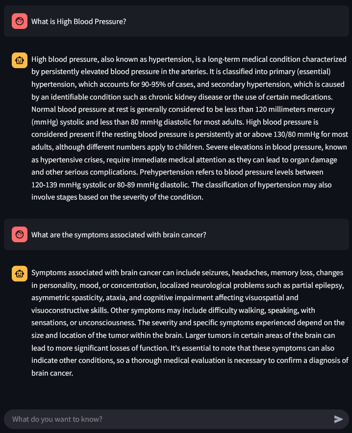

# MediQA
A medical assistant to answer all of your medic-related questions

<center></center>


MediQA is a completely local Medical Question Answering program that allows users to get answers to their health-related questions. It uses Local LLMs behind the scenes, powered by Retrieval-Augmented Generation frameworks to improve answer accuracy and quality. 

## How it works:
This application creates a local vector database using ChromaDB, populated by more than 6000 descriptions of medical terms. Included are medical procedures, illnesses and conditions, symptoms, causes, treatments, and more. It then uses a pre-trained Language Model, fine-tuned on medical topics provided by the community on HuggingFace. Once an user asks a question, it is used to extract relevant information to the question from the vector database, which is then passed to the Language Model as additional context for answering the question.

## Performance:
Baseline performance for several models benchmarked for this task is the following:
|                                       | RougeLsum | Bleu   |
|---------------------------------------|-----------|--------|
| Medicine-LLM                          | 0.0510    | 0.0035 |
| Medical_Doctor_AI-Mistral-7B-Instruct | 0.2006    | 0.0390 |
| Bio-Medical-Llama-3-8B                | 0.1466    | 0.0328 |
| Zephyr-7b-beta                        | 0.2022    | 0.0455 |

After applying MediQA RAG on the best-performing model above, we obtained the following performance

|                | RougeLsum | Bleu   |
|----------------|-----------|--------|
| Zephyr-7b-beta | 0.1804    | 0.0525 |

While Rouge went down, our Bleu score increased significantly. This means that our RAG application is capable of generating more text that aligns with the reference, but may be missing some parts of the answers that are expected to be contained based on the reference implementation.

For more details on the approach and technical decisions made, explore the notebooks at `mediqa/notebooks`

## How to run

### Setup
First install the project and its dependencies.
```
pip install -e .
```

Then, preprocess the evaluation dataset
```
python mediqa/processing/preprocess.py
```

Finally, create and populate your vector database
```
python mediqa/rag/manager.py
```

### Execution
#### Manually
To execute the platform, you can run first the API with the following command
```
uvicorn mediqa.app:app --host=0.0.0.0 --port=8080
```
and the web ui with
```
streamlit run mediqa/webui.py --server.address=0.0.0.0 --server.port=8081
```

#### With Docker
A docker configuration has been provided, which already contains the seeded vector database, as well as the execution of both API and Web UI as their own services. To run, simply execute the following command
```
docker compose up
```
Note: It may take a few minutes to run, as it has to download the model at startup

Once the app has loaded successfully, you can access the Web UI at
```
http://localhost:8081
```
As well as the API documentation at
```
http://localhost:8080/docs
```


## Questions
### Why use a local model?
When it comes to medical data, privacy is a big concern both for the people in the industry as well as patients. While services like ChatGPT, Anthropic and Claude may provide better responses at low cost, the fact that the user or service provider doesn't have control over the use of their data is a discouragement. Allowing those that want to use a service to be able to use a private model reduces the trust footprint.

### Why a RAG system?
RAGs are a cost-effective way of improving model performance on tasks where responses can be enhanced by providing ground truth data in real-time. Because of this, they're often the first step towards increasing model performance. They also provide the benefit that including new sources of data doesn't require model re-training. This makes it a suitable solution for tasks where documents are subject to change or to increase over time.

### Why use Embed Anything?
There are many tools for building a RAG system, some of which are more popular than others, like *Sentence Transformers*, *LangChain*, etc. The reason behind opting for *Embed Anything* was because of their Vector Database Adapters abstraction. By abstracting the layer that connects the embedder to the vector database, it provides great flexibility when it comes to using different database platforms. This makes it easy to extend to the platform of preference. 

## Future Improvements
The following are some suggestions to further improve the project and performance of the application:
- **Fine tune with the provided data**: During the conceptualization of the project, it was suggested that the provided data could be used for evaluation and benchmarking of different models and approaches. While this is a sensible decision, it isn't really necessary to evaluate performance with such a vast number of examples. Additionally, only a small subset of the data was used as such, due to time constraints. We could make better use of the data by fine-tuning the model on a portion of this dataset. This can be done cost-effectively by using LoRA or QLoRA, which allows adjusting model weights of large language model on accessible compute resources. 
- **Obtain more documents for RAG**: This project makes use of a single source of truth for populating the vector database. While this might be sufficient, spending some effort for finding additional sources that may complement the ones already being used can increase model performance.
- **Streaming model responses**: Most people are accostumed to interacting with a Large Language Model with response streaming. This is often useful because responses can often take a long time to generate in its entirety. Streaming responses is a simple way of improving user experience.
- **Provide options for using hosted models**: While privacy was discussed previously, it would be ideal to leave this as a configuration option rather than a hardcoded functionality of the program. If users feel okay with sharing their data with third-party services, and want to have the increased performance that services such as ChatGPT may provide, it should be easy for them to modify the `config.yml` to include their service details.
- **Include additional vector database adapters**: In this project only a single adapter was provided for ChromaDB. This means that if an user wants to deploy their own solution, they have to either use ChromaDB or provide their own adapter. *Embed Anything* already provides several examples for different adapters, so it could be easy to adjust them to owr API and increase the number of options users have when deploying the app. Some popular options could be PineCone or ElasticSearch.
- **Allow for conversation memory & multi-message queries**: The current implementation only takes into account the latest user message to respond. This means that follow-up questions will not be understood by the system. While this is okay for the purposes of this exercise, allowing for multi-message conversations would be a must for a system like this, more so given that the provided UI looks like a chat platform, which intuitively would lead users to think that follow-up questions are allowed.
- **More iteration**: This project demonstrates how to build a RAG system, yet it doesn't delve deep into how to maximize its performance. One of the important next-steps that must be taken is to explore different prompts, datasets and models to see what combination yields the best results.

NOTE: No AI Assistant was used to develop this project.
